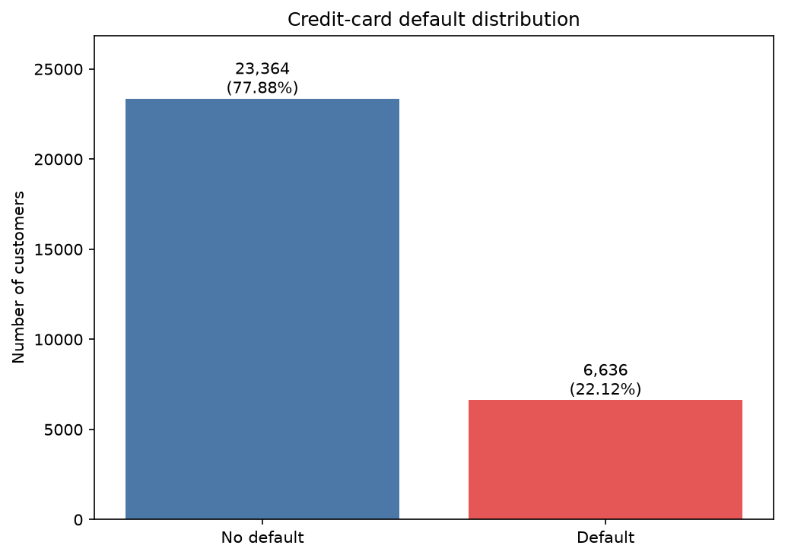
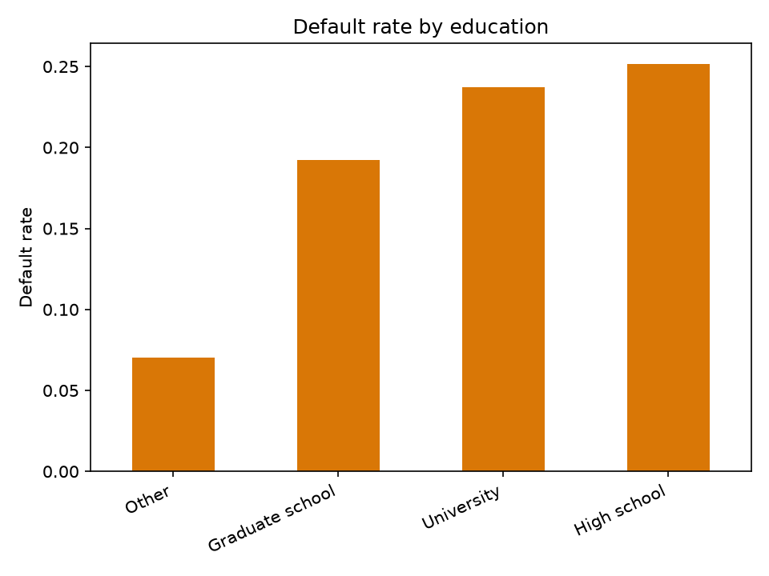
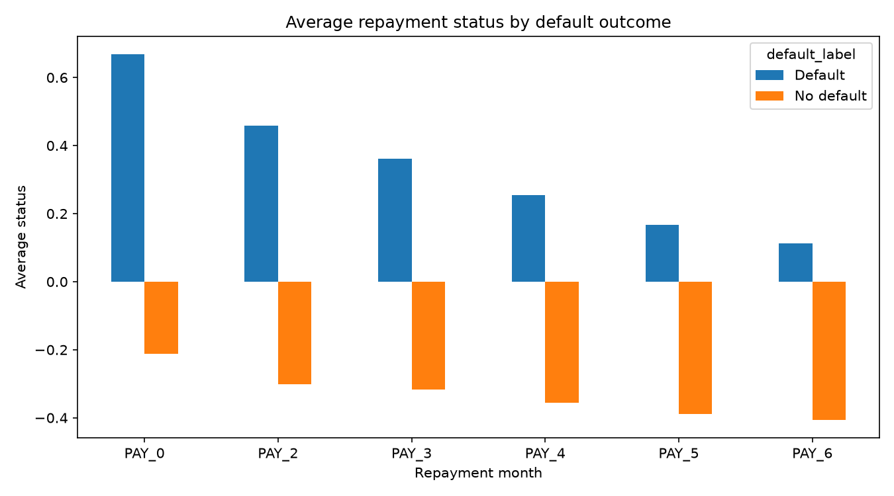
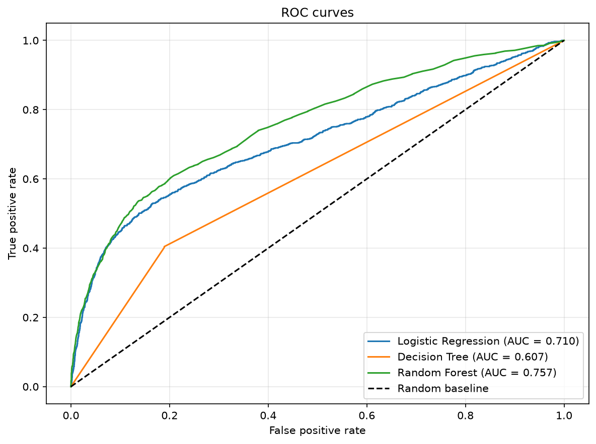
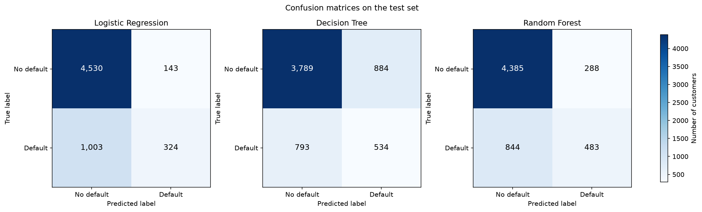

# Credit Card Default Risk Prediction

## 1. Project Overview

This project predicts whether a credit-card customer will default on their next payment. It covers data preprocessing, exploratory data analysis, baseline machine-learning models, evaluation, and performance visualization.

## 2. Problem Statement

Credit-card default prediction can help identify customers who may need earlier support or risk assessment. The goal is to use customer demographic, credit-limit, repayment-history, bill, and payment information to classify customers as:

- `0`: No default
- `1`: Default

## 3. Dataset

The project uses the Taiwan credit-card clients dataset:

- Source file: `data/default of credit card clients.xls`
- Rows: 30,000 customers
- Target: `default payment next month`, renamed to `default`
- Default rate: 22.12%
- Features include credit limit, age, education, marital status, repayment status, bill amounts, and payment amounts

The preprocessing script creates `data/cleaned_credit_card_data.csv` for modeling.

## 4. Technologies Used

- Python
- pandas for data loading and transformation
- scikit-learn for machine learning and evaluation
- matplotlib for charts
- xlrd for reading the `.xls` dataset

Install the dependencies with:

```powershell
.\.venv\Scripts\python.exe -m pip install -r requirements.txt
```

## 5. Project Structure

```text
credit-card-default-risk-prediction/
├── data/
│   ├── default of credit card clients.xls
│   └── cleaned_credit_card_data.csv       # Generated
├── results/
│   └── figures/                           # Generated charts
├── src/
│   ├── data_preprocessing.py
│   ├── eda.py
│   └── model.py
├── .gitignore
├── README.md
└── requirements.txt
```

## 6. Data Preprocessing

`src/data_preprocessing.py`:

- Loads the original Excel dataset
- Renames the target column to `default`
- Removes the customer ID
- Groups unknown education and marriage codes into an `Other` category
- Converts categorical columns into dummy variables
- Saves the cleaned data as a CSV file

## 7. Exploratory Data Analysis

`src/eda.py` examines:

- The number and proportion of defaults
- Credit Card default distribution
- Credit-limit distributions
- Age differences between default and non-default customers
- Education-level default rates
- Repayment history
- Bill and payment amounts
- Features with the strongest relationships to default

The dataset was analyzed to understand customer characteristics,
repayment behavior, and patterns associated with credit-card default.

### Credit Card Default Distribution



This graph shows the distribution of customers based on whether they defaulted on their next credit-card payment. The dataset contains **23,364** customers who did not default and **6,636** customers who defaulted, giving an overall default rate of **22.12%**.

### Default Rate by Education



This graph compares the default rate across different education groups. The observed default rates were 25.16% for high-school customers, 23.73% for university customers, 19.23% for graduate-school customers, and 7.05% for the other group.

### Repayment History



This graph compares the average repayment status across the previous six repayment periods. Customers who defaulted generally had higher repayment-status values, indicating more payment delays compared with customers who did not default.

EDA charts are saved to `results/figures/`.

## 8. Machine Learning Models

`src/model.py` trains and compares:

1. Logistic Regression with feature scaling
2. Decision Tree
3. Random Forest with 200 trees

The data is split into 80% training and 20% testing sets using stratification and a fixed random seed of 42.

## 9. Model Evaluation

The models are evaluated on the unseen test set using:

- Accuracy
- Precision
- Recall
- F1-score
- Confusion matrix
- ROC-AUC

Three classification models were evaluated using accuracy,
precision, recall, F1-score, ROC-AUC, and confusion matrices.

### ROC Curve



The ROC curve compares the ability of the three models to distinguish between customers who defaulted and those who did not across different classification thresholds. **Random Forest achieved the highest ROC-AUC of 0.7572** among the three baseline models.

### Confusion Matrices



The matrices compare correct and incorrect predictions for the three models. Logistic Regression has higher precision but misses more defaulters, while Random Forest detects more defaulters with fewer false positives than the Decision Tree..

The script also generates:

- `results/figures/confusion_matrices.png`
- `results/figures/roc_curves.png`

### Baseline results

| Model | Accuracy | Precision | Recall | F1-score | ROC-AUC |
|---|---:|---:|---:|---:|---:|
| Logistic Regression | 0.8090 | 0.6938 | 0.2442 | 0.3612 | 0.7099 |
| Decision Tree | 0.7205 | 0.3766 | 0.4024 | 0.3891 | 0.6073 |
| Random Forest | 0.8113 | 0.6265 | 0.3640 | 0.4604 | 0.7572 |

## 10. Findings

- 6,636 customers defaulted, giving an overall default rate of 22.12%.
- Defaulting customers had a lower median credit limit than non-defaulting customers.
- Age distributions were very similar between the two groups.
- High-school and university customers had higher default rates than graduate-school customers in this dataset.
- Repayment history was the strongest signal: defaulting customers had more months with serious delinquency.
- Random Forest provided the strongest baseline ROC-AUC and F1-score.
- Accuracy alone is not enough because the target is imbalanced; recall, F1-score, confusion matrices, and ROC-AUC provide additional insight.

## 11. Conclusion

The project demonstrates a complete baseline workflow for credit-card default prediction. Repayment behavior was more informative than age, while the Random Forest gave the best overall baseline performance among the three tested models. Future work could include hyperparameter tuning, threshold optimization, class-imbalance techniques, and additional model interpretability analysis.

## 12. How to Run

From the project root, create and activate the virtual environment:

```powershell
py -m venv .venv
.\.venv\Scripts\Activate.ps1
python -m pip install -r requirements.txt
```

Run preprocessing first:

```powershell
python src/data_preprocessing.py
```

Run exploratory analysis:

```powershell
python src/eda.py
```

Train models, print metrics, and generate performance plots:

```powershell
python src/model.py
```

## Author

Harini T 

AI & Data Science Student